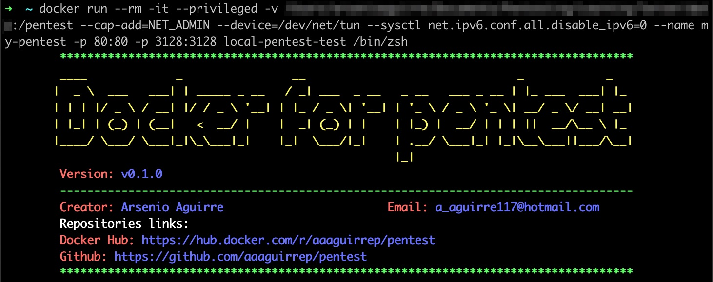

<!-- markdownlint-disable MD033 MD041 -->

  

 

  
  
  
    
  
  
    
  
    
    
  

Docker for pentest is an image with the more used tools to create an pentest environment easily and quickly.

## Features

- OS, networking, developing and pentesting tools installed.
- Connection to HTB (Hack the Box) vpn to access HTB machines.
- Popular wordlists installed: SecLists, dirb, dirbuster, fuzzdb, wfuzz and rockyou.
- Proxy service to send traffic from any browsers and burp suite installed in your local directory.
- Exploit database installed.
- Tool for cracking password.
- Linux enumeration tools installed.
- Tools installed to discovery services running.
- Tools installed to directory fuzzing.
- Monitor for linux processes without root permissions
- Zsh shell installed.

## Tools installed

### Operative system tools

    rdate
    vim
    zsh
    oh-my-zsh
    locate
    cifs-utils

### Network tools

    traceroute
    telnet
    net-tools
    iputils-ping
    tcpdump
    openvpn
    whois
    host
    prips

### Developer tools

    git
    curl
    wget
    ruby
    go
    python
    python-pip
    python3
    python3-pip

### Pentest tools

#### Port scanning

- [nmap](https://github.com/nmap/nmap)
- [masscan](https://github.com/robertdavidgraham/masscan)
- [ScanPorts](https://github.com/aaaguirrep/scanPorts) created by [@s4vitar](https://github.com/s4vitar) with some improvements

#### Crawler

- [hakrawler](https://github.com/hakluke/hakrawler)
- [Photon](https://github.com/s0md3v/Photon.git)
- [waybackurls](https://github.com/tomnomnom/waybackurls)
- [gospider](https://github.com/jaeles-project/gospider)

#### Recon

- [Amass](https://github.com/OWASP/Amass)
- [GoBuster](https://github.com/OJ/gobuster)
- [Knock](https://github.com/guelfoweb/knock)
- [MassDNS](https://github.com/blechschmidt/massdns)
- [Altdns](https://github.com/infosec-au/altdns)

#### Discovery

- [hakrevdns](https://github.com/hakluke/hakrevdns)
- [whatweb](https://github.com/urbanadventurer/WhatWeb.git)
- [wafw00z](https://github.com/EnableSecurity/wafw00f.git)
- [nikto](https://github.com/sullo/nikto)
- [wfuzz](https://github.com/xmendez/wfuzz)
- [dirsearch](https://github.com/maurosoria/dirsearch.git)
- [ffuf](https://github.com/ffuf/ffuf)
- [arjun](https://github.com/s0md3v/Arjun)
- [wpscan](https://github.com/wpscanteam/wpscan)
- [joomscan](https://github.com/rezasp/joomscan)

#### Wordlist

- [cewl](https://github.com/digininja/CeWL)
- wordlists:
  - [wfuzz](https://github.com/xmendez/wfuzz.git)
  - [SecList](https://github.com/danielmiessler/SecLists.git)
  - [Fuzzdb](https://github.com/fuzzdb-project/fuzzdb.git)
  - [Dirbuster](https://github.com/daviddias/node-dirbuster.git)
  - [Dirb](https://github.com/v0re/dirb.git)
  - [Rockyou](https://github.com/brannondorsey/naive-hashcat/releases/download/data/rockyou.txt)
- crunch

#### Git repositories

- [gitleaks](https://github.com/zricethezav/gitleaks)
- [gitrob](https://github.com/michenriksen/gitrob)
- [gitGraber](https://github.com/hisxo/gitGraber.git)
- [github-search](https://github.com/gwen001/github-search.git)

#### OWASP

- [sqlmap](https://github.com/sqlmapproject/sqlmap.git)
- [XSStrike](https://github.com/s0md3v/XSStrike.git)

#### Brute force

- [crowbar](https://github.com/galkan/crowbar.git)
- [hydra](https://github.com/vanhauser-thc/thc-hydra)
- [patator](https://github.com/lanjelot/patator.git)
- medusa

#### Cracking

- [hashid](https://github.com/psypanda/hashID)
- [john the ripper](https://github.com/magnumripper/JohnTheRipper)
- [hashcat](https://github.com/hashcat/hashcat)

#### OS Enumeration

- [htbenum](https://github.com/SolomonSklash/htbenum.git)
- [linux-smart-enumeration](https://github.com/diego-treitos/linux-smart-enumeration.git)
- [linenum](https://github.com/rebootuser/LinEnum.git)
- [enum4linux](https://github.com/portcullislabs/enum4linux.git)
- [ldapdomaindump](https://github.com/dirkjanm/ldapdomaindump)
- [PEASS - Privilege Escalation Awesome Scripts SUITE](https://github.com/carlospolop/privilege-escalation-awesome-scripts-suite.git)
- [Windows Exploit Suggester - Next Generation](https://github.com/bitsadmin/wesng.git)
- [smbmap](https://github.com/ShawnDEvans/smbmap.git)
- [pspy - unprivileged Linux process snooping](https://github.com/DominicBreuker/pspy)
- smbclient
- ftp

#### Exploits

- [searchsploit](https://github.com/offensive-security/exploitdb.git)
- [Metasploit](https://github.com/rapid7/metasploit-framework)
- [MS17-010](https://github.com/worawit/MS17-010.git)
- [AutoBlue-MS17-010](https://github.com/3ndG4me/AutoBlue-MS17-010.git)
- [PrivExchange](https://github.com/dirkjanm/PrivExchange)

#### Windows

- [evil-winrm](https://github.com/Hackplayers/evil-winrm)
- [impacket](https://github.com/SecureAuthCorp/impacket)
- [CrackMapExec](https://github.com/byt3bl33d3r/CrackMapExec)
- [Nishang](https://github.com/samratashok/nishang.git)
- [Juicy Potato](https://github.com/ohpe/juicy-potato.git)
- [PowerSploit](https://github.com/PowerShellMafia/PowerSploit.git)
- [pass-the-hash](https://github.com/byt3bl33d3r/pth-toolkit.git)
- [mimikatz](https://github.com/gentilkiwi/mimikatz)
- gpp-decrypt

#### Reverse shell

- [netcat](https://github.com/diegocr/netcat)
- [rlwrap](https://github.com/hanslub42/rlwrap)

#### Other resources

- [pentest-tools](https://github.com/gwen001/pentest-tools) from [@gwen001](https://github.com/gwen001)
- [qsreplace](https://github.com/tomnomnom/qsreplace) from [@tomnomnom](https://github.com/tomnomnom/qsreplace)

### Custom functions

- NmapExtractPorts from [@s4vitar](https://github.com/s4vitar)

### Other services

    apache2
    squid

## Usage

### Prerequisites

- Docker service installed

You can use the docker image by the next two options:

### Option 1 - Use the github repository

    git clone --depth 1 https://github.com/aaaguirrep/pentest.git
    cd pentest
    docker build -t pentest .
    docker run --rm -it --name my-pentest pentest /bin/zsh

### Option 2 - Use the image from docker hub

Use image from docker hub: [aaaguirrep/pentest](https://hub.docker.com/r/aaaguirrep/pentest)

    docker pull aaaguirrep/pentest
    docker run --rm -it --name my-pentest pentest /bin/zsh

### Considerations to run the container

There are differents use cases for use the image and you should know how to run the container properly.

1. Use the container to access HTB (Hack the Box) machines by HTB vpn.

        docker run --rm -it --cap-add=NET_ADMIN --device=/dev/net/tun --sysctl net.ipv6.conf.all.disable_ipv6=0 --name my-pentest aaaguirrep/pentest /bin/zsh

2. Share information from your local directory to container directory and save information on your local directory. You should save information under /pentest directory.

        docker run --rm -it -v /path/to/local/directory:/pentest --name my-pentest aaaguirrep/pentest /bin/zsh

3. Expose internal container services (apache, squid) for your local environment.

        docker run --rm -it --name my-pentest -p 80:80 -p 3128:3128 aaaguirrep/pentest /bin/zsh

    Inside the container start apache2 and squid services by the aliases.

        apacheUp
        squidUp

4. Mount directories by umount command.

        docker run --rm -it --privileged --name my-pentest aaaguirrep/pentest /bin/zsh

5. Tools are downloaded in /tools directory.

## Nice configurations

You can set up the docker image with nice configurations like as:

### 1. Alias to connect to HTB (Hack the Box) VPN

To use both options you should use -v option to map local directoty with /pentest container directory.

#### Option 1 - HTB VPN using github repository

Add the next line in step "Create shorcuts" in Dockerfile, build a new image and run a new container with the -v option.

    RUN echo "alias vpnhtb=\"openvpn /pentest/path/to/ovpn/file\"" >> /root/.zshrc

#### Option 2 - HTB VPN using docker hub image

Create a new Dockerfile with the next steps, build a new image and run a new container with -v option.

    FROM aaaguirrep/pentest

    # Create a shortcut and load the ovpn file from workstation
    RUN echo "alias vpnhtb=\"openvpn /pentest/path/to/ovpn/file\"" >> /root/.zshrc

### 2. Save and load command history in your local environment

When you delete a container all information is deleted incluide command history. The next configuration provides you an option for save the command history in your local environment and load it when you run a new container. So, you wont lose your command history when run a new container.

To use both options you should use -v option to map local directoty with /pentest container directory.

#### Option 1 - Command history using github repository

Add the next line in step "Create shorcuts" in Dockerfile, build a new image and run a new container.

    # Save and load command history in your local environment
    RUN sed -i '1i export HISTFILE="/pentest/.zsh_history"' /root/.zshrc

#### Option 2 - Command history using docker hub image

Create a new Dockerfile with the next steps, build a new image and run a new container.

    FROM aaaguirrep/pentest

    # Save and load command history in your local environment
    RUN sed -i '1i export HISTFILE="/pentest/.zsh_history"' /root/.zshrc

## :heavy_check_mark: Environment tested

The image was tested in the following environments:

- Docker service for Mac: Docker version 19.03.5, build 633a0ea

- Docker service for Linux instance on Google Cloud Platform: Docker version 19.03.6, build 369ce74a3c

## :warning: Warning

Do not save information on container directories because it will be lost after delete the container, you should save information in your local environment using the parameter -v when you run the container. For instance:

    docker run --rm -it -v /path/to/local/directory:/pentest --name my-pentest aaaguirrep/pentest /bin/zsh

The above command specify a path local directory mapped with /pentest container directory. You should save all information under /pentest directory.

## Contributing

[Contributing Guide](CONTRIBUTING.md)

## License

[MIT](LICENSE)

Copyright (c) 2020, Arsenio Aguirre
